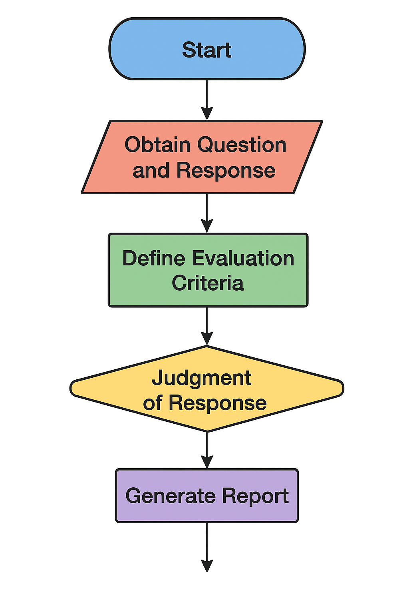

# Agentic Evaluation Framework - RoBERTs---P4

## Overview

This project addresses Problem 4 (P4) of the hackathon: creating an automated framework for evaluating AI agent responses at scale.  Our solution, **Agentic Evaluation Framework**, combines multiple AI agents, feature extraction, BERT fine-tuning, and LLM-based judgment to provide a comprehensive and interpretable evaluation of agent performance.

## Problem Statement

As AI agents proliferate, ensuring their reliability and trustworthiness is paramount.  This project tackles the challenge of automatically evaluating agent responses across key dimensions:

*   **Instruction Following:** Does the agent adhere to the prompt's instructions?
*   **Hallucination Detection:** Does the agent fabricate information?
*   **Assumption Control:** Does the agent make unwarranted assumptions?
*   **Coherence & Accuracy:** Is the response logical, well-structured, and factually correct?

Manual evaluation is infeasible at scale.  Our framework provides an automated solution for scoring and analyzing thousands of agent responses.

## Solution Architecture

The Agentic Evaluation Framework employs a multi-stage pipeline:

1.  **Agent Response Generation:** Generate diverse responses using multiple AI agents with distinct personas.
2.  **Feature Extraction:** Extract relevant lexical and semantic features from the responses.
3.  **BERT Fine-Tuning & Prediction:** Fine-tune a BERT model to predict an instruction-following score based on the extracted features.
4.  **LLM-Based Judgment:** Leverage an LLM to cross-check factual accuracy, evaluate coherence, and provide a final verdict, incorporating the BERT score.
5.  **Reporting:** Generate a comprehensive report summarizing the evaluation results.

### Flowchart (Suggested)


[Prompt] --> [Agent 1] --> [Response 1] --> [Agent 2] --> [Response 2] --> [Feature Extraction (reg.py)] --> [BERT Fine-Tuning] --> [BERT Prediction] --> [LLM Judge] --> [Final Report] --> [Agent 3] --> [Response 3]


## Components

*   **`agent.py`:**
    *   Generates responses to prompts using three AI agents with different personas (Factual Reporter, Enthusiastic Storyteller, Skeptical Analyst).
    *   Leverages Langchain and Google Gemini Flash API.
    *   Generates responses with a random word count to introduce variability.
    *   Saves the generated responses to `results.json`.
*   **`reg.py` (Feature Extraction):**
    *   Extracts lexical and semantic features from the agent responses.
    *   Calculates metrics such as keyword recall, extraneous content ratio, semantic alignment, hallucination risk, and more.
    *   Employs `sentence-transformers` (MiniLM) for semantic similarity calculations.
    *   Classifies the domain of the prompt (QA, Summarization, Reasoning).
    *   Saves the extracted features to `eval_results_full.json` and `eval_results_compact.csv` for BERT fine-tuning.
*   **`BERT Fine-Tuning (Notebook)`:**
    *   *(This is a conceptual component - the notebook itself isn't directly part of the deployable app)*
    *   Fine-tunes a BERT model using the extracted features from `eval_results_compact.csv`.
    *   The fine-tuned model is saved for use in the `app.py`.
*   **`src/pipeline/app.py` (Streamlit Application):**
    *   Deploys the evaluation pipeline as a Streamlit application.
    *   Loads the fine-tuned BERT model.
    *   Takes a prompt and agent response as input.
    *   Calculates features, obtains a BERT prediction, and queries an LLM judge (using OpenRouter API).
    *   Generates a final report combining the BERT score, LLM judgment, and feature analysis.

## Key Features

*   **Multi-Agent Diversity:**  Generates diverse responses using agents with different personas, providing a more robust evaluation.
*   **Comprehensive Feature Set:** Extracts a wide range of lexical and semantic features to capture different aspects of response quality.
*   **BERT Fine-Tuning:** Leverages transfer learning to create a specialized model for predicting instruction-following.
*   **LLM-Based Judgment:** Integrates an LLM to assess factual accuracy and coherence, addressing limitations of automated metrics.
*   **Explainability:** Provides insights into why an agent received a particular score by highlighting key features and the LLM judge's justification.
*   **Streamlit Interface:**  Offers a user-friendly interface for running evaluations and visualizing results.

## Code Highlights

*   **`agent.py`:** Demonstrates the use of Langchain and the Gemini Flash API to create diverse agent responses.
    ```python
    # Example from agent.py
    from langchain_google_genai import ChatGoogleGenerativeAI
    llm = ChatGoogleGenerativeAI(model="gemini-2.5-flash-preview-05-20", temperature=0.7)
    ```
*   **`reg.py`:** Showcases feature extraction techniques, including semantic similarity calculation using `sentence-transformers`.
    ```python
    # Example from reg.py
    from sentence_transformers import SentenceTransformer, util
    SEM_MODEL = SentenceTransformer("all-MiniLM-L6-v2")
    ```
*   **`app.py`:**  Illustrates the integration of BERT predictions and LLM judgment to generate a comprehensive evaluation report.
    ```python
    # Example from app.py
    bert_prediction = classifier(input_bert_formatted, truncation=True)
    llm_judgment = judge_response(question, response_text, evaluation_criteria, bert_score_data)
    ```

## Setup and Usage

1.  **Install Dependencies:**
    ```bash
    pip install -r requirements.txt
    ```
2.  **Configure API Keys:**
    *   Set the `GOOGLE_API_KEY` environment variable for the Gemini API.
    *   Add your OpenRouter API key to Streamlit secrets (create a `.streamlit/secrets.toml` file).
3.  **Fine-Tune BERT Model:**
    *   Run the provided BERT fine-tuning notebook.
    *   Ensure the fine-tuned model is saved in the `src/BERT_config` directory.
4.  **Run the Streamlit Application:**
    ```bash
    streamlit run src/pipeline/app.py
    ```

## Evaluation

The framework addresses the evaluation specifics as follows:

*   **Robustness of Scoring Methodology:** Combines multiple evaluation methods (feature-based, BERT, LLM) to provide a more robust and reliable assessment.
*   **Scalability:** Supports batch processing of responses and can be deployed to handle large-scale evaluations.
*   **Interpretability:** Provides clear evaluation outputs, including scores, feature analysis, and LLM justifications.
*   **Creativity:**  Employs a hybrid AI-judge system and novel metrics (e.g., user frustration proxy, overconfidence score).

## Stretch Goals Achieved

*   **Explainability:** The LLM judge provides justifications for its scores, explaining why an agent received a low score.  The feature analysis in `app.py` also contributes to explainability.
*   **Integration with LLMs for "AI Judges":** The framework integrates with an LLM (via OpenRouter) to provide a qualitative assessment of the agent responses.

## Future Enhancements

*   **Visualization of Evaluation Trends:** Implement heatmaps and charts to visualize performance trends across agents and prompts.
*   **Support for Multiple Domains:** Expand the domain classification and adherence metrics to support a wider range of tasks.
*   **Improved Hallucination Detection:** Integrate more sophisticated hallucination detection techniques.
*   **Automated Fine-Tuning Pipeline:** Automate the BERT fine-tuning process.

## Team

*   [Your Name]

## Standing Ovation!

We believe that the Agentic Evaluation Framework offers a novel and effective solution for evaluating AI agent responses at scale. Its combination of diverse agents, feature extraction, BERT fine-tuning, and LLM-based judgment provides a comprehensive and interpretable assessment of agent performance. We are confident that this project will contribute to the development of more reliable and trustworthy AI systems.