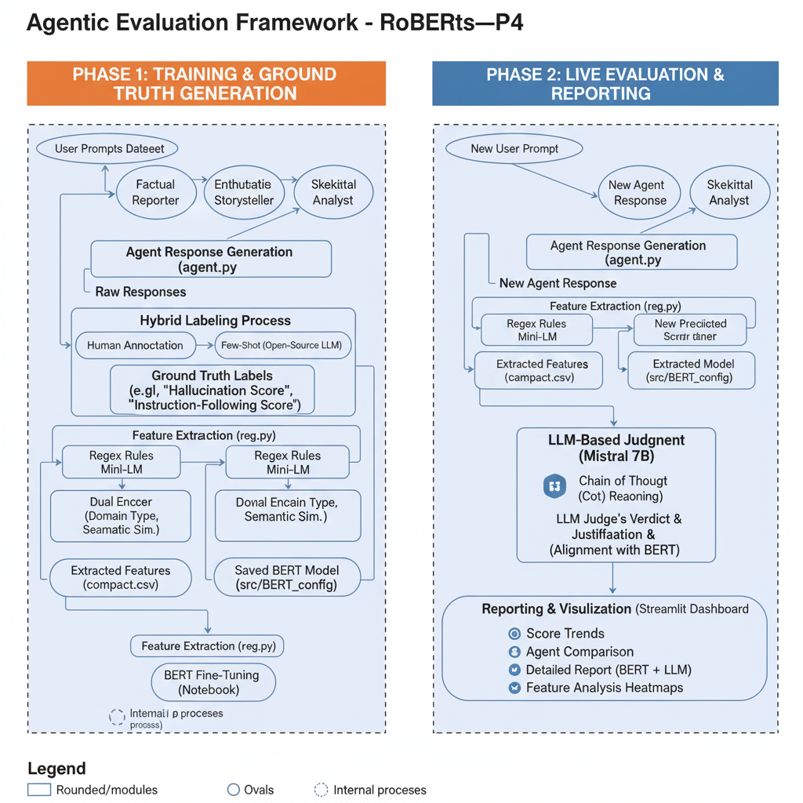

# EthosAI 🐧
Hola amigos! First a Demo of the Project .
[text](git_exmp.webm)

## Overview
We tried to mimic a real-world setup where different AI agents give very different kinds of answers to the same prompt. So, we built 3 agents with fixed personas  **a Reporter, a Deep Critical Thinker and a Carefree Storyteller** using system prompts. We then labeled these responses across dimensions like  **“Hallucination Score,” "Conciseness Score", "Assumption Control Score", "Instruction-Following Score"** using a hybrid approach of human based  and using an open-source model using **Few-Shot Learning**. These became our ground truth labels.

From there, we designed a hybrid evaluation pipeline. First, we generated features from each {prompt, response} pair using regex rules + a small Language Model (things like how closely the response sticks to the prompt, assumptions made, contradictions, domain type  using a DUAL Encoder , overconfidence score .). Then we **fine-tuned** a **BERT model on those features + our ground truth labels**, so it can predict scores automatically.

Finally, during evaluation, when a new response comes in, we run it through the feature extractor → fine-tuned BERT for scoring → and also through a factual check step using a Mistral model. The **“AI Judge” (Mistral)** looks at both the response and the BERT score, and gives a verdict on whether the evaluation seems valid and also gives the reason for the score evaluated and its alignment with the BERT score using a detailed **CoT - Chain of Thought reasoning**. We show all of this in a Streamlit dashboard that tracks score trends, compares agents on the same prompt, and makes the whole process more transparent.

The idea is that this pipeline can scale beyond just our 3 toy agents, and help evaluate lots of different models in a more explainable, layered way — not just “one black-box score.”

## Problem Statement-4 - AI agent Evaluation framework
Building an AI agent Evaluation framework, we aim to create a robust system that can assess the performance of various AI agents across multiple dimensions. This involves not only scoring their responses but also providing insights into their reasoning processes and potential biases.

## Solution Architecture

The Agentic Evaluation Framework employs a multi-stage pipeline:

1.  **Agent Response Generation & Labelling:** Generate the dataset of diverse responses using multiple AI agents with distinct personas and labelled it using a Hybrid Approach of Manual Labelling + Few-Shot Learning.
2.  **Feature Extraction:** Extract relevant lexical and semantic features from the responses using Regex+Mini-LM and Dual Encoder Techniques.
3.  **BERT Fine-Tuning & Prediction:** Fine-tuned a BERT model to predict an instruction-following score based on the extracted features in previous step for each {prompt,response} pair.
4.  **LLM-Based Judgment:** Leverage an Open Source LLM ( Mistral 7B instruct ) to cross-check factual accuracy, evaluate coherence, and provide a final verdict, incorporating the BERT score and reason through CoT (Chain of Thought) the possible reasons for High or Low variation.
5.  **Reporting:** Generate a comprehensive report summarizing the evaluation results.


### Flowchart (Suggested)


[Prompt] --> [Agent 1] --> [Response 1] --> [Agent 2] --> [Response 2] --> [Feature Extraction (reg.py)] --> [BERT Fine-Tuning] --> [BERT Prediction] --> [LLM Judge] --> [Final Report] --> [Agent 3] --> [Response 3]


## Components

*   **`agent.py`:**
    *   Generates responses to prompts using three AI agents with different personas (
        Factual Reporter => ( responds what it thinks is the most factual answer ), 
        Enthusiastic Storyteller => ( responds with a creative and engaging narrative ), 
        Skeptical Analyst => ( questions assumptions and provides critical insights )).
    *   Leverages Langchain and Google Gemini Flash API.
    *   Generates responses with a random word count to introduce variability in the dataset.
    *   Saves the generated responses to `results.json`.
*   **`reg.py` (Feature Extraction):**
    *   Extracts lexical and semantic features from the agent responses.
    *   Calculates metrics such as keyword recall, extraneous content ratio, semantic alignment, hallucination risk, and more.
    *   Employs `sentence-transformers` (MiniLM) for semantic similarity calculations.
    *   Classifies the domain of the prompt (QA, Summarization, Reasoning).
    *   Saves the extracted features to `eval_results_full.json` and `eval_results_compact.csv` for BERT fine-tuning.
*   **`BERT Fine-Tuning (Notebook)`:**
    *   Fine-tuned a BERT model using the extracted features from `eval_results_compact.csv` and the ground truth labels generated from the ( manual + few shot learning label generation ) file.( LABEL = InformationAccuracy for now )
    *   The fine-tuned model is saved for use in the `app.py`.
*   **`src/pipeline/app.py` (Streamlit Application):**
    *   Deploys the evaluation pipeline as a Streamlit application.
    *   Loads the fine-tuned BERT model.
    *   Takes a prompt and agent response as input.
    *   Calculates features, obtains a BERT prediction, and queries an LLM judge (using OpenRouter API).
    *   Generates a final report combining the BERT score, LLM judgment, and feature analysis
    * and in final verdict , the LLM judge also provides the reason for the score evaluated and its alignment with the BERT score through CoT (Chain of Thought) reasoning.


## Key Features

*   **Multi-Agent Diversity:**  Generates diverse responses using agents with different personas, providing a more robust evaluation.
*   **Comprehensive Feature Set:** Extracts a wide range of lexical and semantic features to capture different aspects of response quality.
*   **BERT Fine-Tuning:** Leverages transfer learning to create a specialized model for predicting instruction-following.
*   **LLM-Based Judgment:** Integrates an LLM to assess factual accuracy and coherence, addressing limitations of automated metrics.
*   **Explainability:** Provides insights into why an agent received a particular score by highlighting key features and the LLM judge's justification.
*   **Streamlit Interface:**  Offers a user-friendly interface for running evaluations and visualizing results.

## Code Highlights

*   **`agent.py`:** Demonstrates the use of Langchain and the Gemini Flash API to create diverse agent responses.
    ```python
    
    from langchain_google_genai import ChatGoogleGenerativeAI
    llm = ChatGoogleGenerativeAI(model="gemini-2.5-flash-preview-05-20", temperature=0.7)
    ```
*   **`reg.py`:** Showcases feature extraction techniques, including semantic similarity calculation using `sentence-transformers`.
    ```python
    
    from sentence_transformers import SentenceTransformer, util
    SEM_MODEL = SentenceTransformer("all-MiniLM-L6-v2")
    ```
*   **`app.py`:**  Illustrates the integration of BERT predictions and LLM judgment to generate a comprehensive evaluation report.
    ```python
    
    bert_prediction = classifier(input_bert_formatted, truncation=True)
    llm_judgment = judge_response(question, response_text, evaluation_criteria, bert_score_data)
    ```

## Setup and Usage

1.  **Install Dependencies:**
    ```bash
    pip install transformers datasets sentence-transformers langchain streamlit google-genai openrouter
    ```
2.  **Configure API Keys:**
    *   We need to set the `GOOGLE_API_KEY` environment variable for the Gemini API.
    *   Also we need to add our OpenRouter API key to Streamlit secrets (create a `.streamlit/secrets.toml` file).
3.  **Fine-Tune BERT Model:**
    *   Run the provided BERT fine-tuning notebook.
    *   Ensure the fine-tuned model is saved in the `src/BERT_config` directory.
4.  **Run the Streamlit Application:**
    ```bash
    streamlit run src/pipeline/app.py
    ```

## Evaluation

The framework addresses the evaluation specifics as follows:

*   **Robustness of Scoring Methodology:** Combines multiple evaluation methods (feature-based, BERT, LLM) to provide a more robust and reliable assessment.
*   **Scalability:** Supports saving and batch processing of responses and can be deployed to handle large-scale evaluations.
*   **Interpretability:** Provides clear evaluation outputs, including scores, feature analysis, and LLM justifications.
*   **Creativity:**  Employs a hybrid AI-judge system that combines CoT (CHAIN of Thought) human-like reasoning with automated metrics (e.g., user frustration proxy, overconfidence score).

## Stretch Goals Achieved

*   **Explainability:** The LLM judge provides justifications for its scores, explaining why an agent received a low score.  The feature analysis in `app.py` also contributes to explainability.
*   **Integration with LLMs for "AI Judges":** The framework integrates with an LLM (via OpenRouter) to provide a qualitative assessment of the agent responses.

## Future Enhancements

*   **Visualization of Evaluation Trends:** Implement heatmaps to visualize performance trends across agents and prompts.
*   **Support for Multiple Domains:** Expand the domain classification (especially for SSummarization) and adherence metrics to support a wider range of tasks.
*   **Improved Hallucination Detection:** Integrate more sophisticated hallucination detection techniques.
*   **Automated Fine-Tuning Pipeline:** Automate the BERT fine-tuning process.

## Team

*   RobERTs

## CONCLUSION

We believe that the Agentic Evaluation Framework offers a novel and effective solution for evaluating AI agent responses at scale. Its combination of diverse agents, feature extraction, BERT fine-tuning, and LLM-based judgment provides a comprehensive and interpretable assessment of agent performance. We are confident that this project will contribute to the development of more reliable and trustworthy AI system in the future of e6data . 